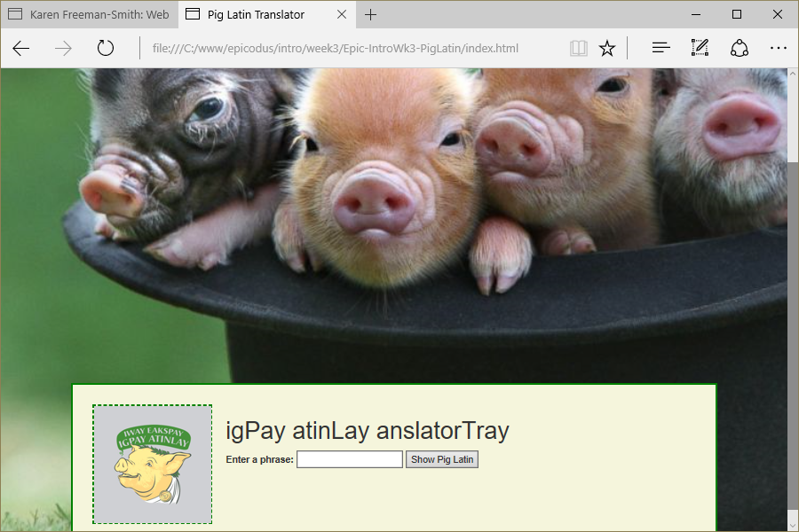

# Pig Latin Translator
Version 0.0.1: August 17, 2016
by [Karen Freeman-Smith](https://karenfreemansmith.github.io) and [Caleb Paul](https://github.com/CalebPaul)

### Technologies Used
HTML, CSS, Bootstrap, JavaScript, jQuery

## Description
*[Epicocus](http://epicodus.com) Intro to Programming Week 3 Pair Project with Caleb Paul: A website that will output a given phrase in pig latin.*

## Setup/Installation
* [View on Github Pages](https://karenfreemansmith.github.io/Epic-IntroWk3-PigLatin)
* _OR_
* Clone directory
* Open index.html in your favorite browser

## Support & Contact
For questions, concerns, or suggestions please email karenfreemansmith@gmail.com

## Specifications
* For words beginning with a vowel, add "ay" to the end.
* For words beginning with one or more consonants, move all of the first consecutive consonants to the end, and add "ay".
* If the first consonants include "qu", move the "u" along with the "q". Don't forget about words like "squeal" where "qu" doesn't come first!_
* For words beginning with "y", treat "y" as a consonant.

## Known Issues
* None

## Legal
*Licensed under the GNU General Public License v3.0*

Copyright (c) 2016 Copyright _[Karen Freeman-Smith](https://karenfreemansmith.github.io) & [Caleb Paul](https://github.com/CalebPaul)_ All Rights Reserved.
